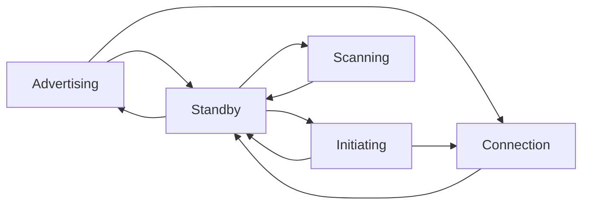
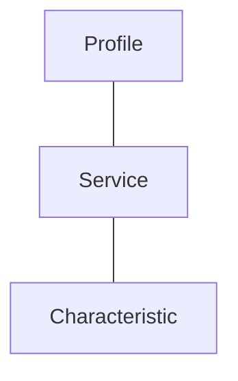

## 0.0 关于BLE

BLE是低功耗蓝牙（Bluetooth Low Energy）的简写，蓝牙4.0包含两个分支：经典4.0（Classic Bluetooth 4.0）和BLE4.0，经典4.0是传统3.0蓝牙升级而成，向下兼容；而BLE 4.0则是新的分支，不向下兼容。

相对于经典蓝牙而言，BLE具有快速搜索、快速连接、超低功耗保持连接和传输数据的优势，但是另一方面而言，数据传输速率低、物理带宽只有1M，实际传输速度只有1~6KB。

BLE连接都是建立在GATT协议之上，GATT是在蓝牙连接之上的发送和接收很短的数据段的通用规范，这些很短的数据段被称为属性。

BLE协议可以分为蓝牙应用和蓝牙核心两个部分，蓝牙核心又包含BLE控制器和BLE 主机两个部分。

BLE主机与BLE控制器之间的接口就是HCI（Host Controller Interface），可基于Uart、USB等物理介质，不影响蓝牙协议的理解。

## 0.1 物理层（Physical Layer）

BLE属于无线通信，通信段为免费的ISM频段（2.4-2.4835 GHz），为了同时支持多个设备，将整个频带分为40个通道，每个通道的带宽为2MHz，BLE的频点为：f=2402 + 2 * k MHz, k=0,...,39.

## 0.2 链路层（Link Layer）

链路层的主要功能就是在物理层之上收发数据，链路层需要解决：

- 物理信道的共享问题
- 传输通道的保证
- 解决物理信道的不可靠问题，比如干扰、丢失数据等，提供了校验、重传等，保证数据的可靠性

### 物理信道的共享问题

1. 数据量较少，发送不频繁，对时延不是很敏感的场景，BLE的链路层选取了3个物理信道，作为广播通道（advertising channel），所有设备都可以进行收发，都共享一个逻辑传输通道
2. 数据量较大、发送频率较高、对时延较敏感的场景，BLE的链路层从剩余的物理信道中选取一个，保证通信双方建立单独的通道，即建立连接的过程。为了增加容量，增大抗干扰能力，连接不会长期使用一个固定的物理信道，会在多个信道之间随机但有规律的切换，即BLE的跳频（Hopping）技术。

### 链路层状态

BLE的链路层抽象出5中状态：

- Standby，为初始状态，不发送数据，不接收数据，根据上层命令可进入任何一种状态。
- Advertising，通过广播通道发送数据，由Standby进入，广播数据可以由Scanning或Initiating状态的设备接收。
- Scanning，通过广播通道接收数据，由Standby进入。
- Initiating ，和Scanning状态类似，是一种特殊的接收状态，由Standby进入，只能接收Advertiser广播的connectable的数据，接收到数据后，发送连接请求，以便与广播者建立连接。建立连接后，初始者和广播者都会切换到Connection状态。
- Connection状态，是和某个设备建立了单独通道连接，连接断开后回到Standby状态。

## 0.3 L2CAP协议

L2CAP全称为逻辑链路控制和适配协议（Logical Link Control and Adaptation Protocol），介于应用程序（Profile、Application）和Link Layer之间的协议。

经过链路层的抽象之后，两个BLE设备之间可存在两条逻辑上的数据通道：一条无连接的广播通道，另一条是基于连接的数据通道，是一个点对点的逻辑通道。

L2CAP协议的主要功能：

1. 协议/通道的多路复用；
2. 上层应用数据（L2CAP Service Data Units， SDUs）的分割和重组，生成协议数据单元（L2CAP Packet Data Units，PDUs），满足用户数据传输对延时的要求，便于后续的重传、流控等机制的实现；
3. 基于L2CAP Channel的流控机制；
4. 错误控制和重传机制；
5. 支持流式传输（如音频、视频等，不需要重传或只需要有限重传）；
6. 协议数据单元的分片和重组，生成符合链路层传输要求的数据片（长度不超过251）；
7. QoS的支持。

L2CAP是低功耗蓝牙（BLE）的复用层，定义了两个基本概念：L2CAP信道和L2CAP命令。L2CAP信道是一个双向数据通道，通过对端设备上的某一特定的协议或规范。

BLE的L2CAP支持数据的分割和重组，能够支持较大的报文传输；复用信道，BLE可以复用三条不同的信道。

用于传输用户数据的逻辑链路只有一条，通过L2CAP的多路复用功能实现三条不同的信道。

低功耗蓝牙有三个固定信道：一个用于信令信道，一个用于安全管理器，一个用于属性协议。

## 0.4 Attribute Protocol（ATT）

在BLE协议栈中，物理层负责提供一系列的物理信道，基于这些物理信道，链路层可以在两个设备之间建立用于点对点通信的逻辑通道，而L2CAP则将这些逻辑通道划分为一个个的L2CAP通道，为应用程序提供通道复用。

BLE抽象出一个协议：Attribute Protocol，通过此协议将信息以属性（Attribute）的形式抽象出来，并提供一些方法，供远端设备读取、修改这些属性的值（Attribute value）。

ATT的主要内容包括：

1. 基于L2CAP，使用固定的通道ID（0x004）;
2. 采用Client-Server的形式，提供属性的一方为ATT Server，访问信息的一方为ATT Client；
3. 一个Attribute由Attribute Type、Attribute Handle和Attribute Value组成。
   - Attritude Type，是用于标识Attribute的类型，使用UUID（Universally Unique Identifier，16-bit，32-bit，128-bit的数值）
   - Attribute Handle，是一个16-bit的数值，用作唯一识别Attribute Server上的所有Attribute
   - Attribute Value代表属性的值，可以是任何固定长度或可变长度的字节数组
4. Attribute可以定义一些权限，以便server控制client的访问行为，包括：
   - 访问有关的权限（access permission），可读性、可写性和读写
   - 加密有关的权限（Encryption permission），需要加密、不需要加密
   - 身份认证有关的权限（Authentication permission），需要认证、不需要认证
   - 授权有关的权限（Authorization permission），需要授权、不需要授权
5. 根据定义的属性的PDU不同，client可以对server有多种访问方式，包括：
   - 查找信息，获取属性类型和属性句柄的对应关系；
   - 读属性，通过类型读、通过句柄读、读Blob（只读取部分信息），Read Multiple（读取多个handle的值）
   - 写属性，包括需要应答的写、不需要应答的写

## 0.5 Generic Attribute Profile（GATT）

GATT描述了一种使用ATT的服务框架的profile（配置文件），profile可以理解为“应用场景、功能、使用方式”都被规定好的应用，GATT用于提供通用的、信息存储和共享等功能。

GATT的层次结构分为：

- Profile是基于GATT所派生出的配置文件，位于GATT的最顶层，由一个或多个某一应用场景有关的Service组成。
- 一个Service包含一个或多个特征，也可以通过Include的方式，包含其他Service。
- Characteristic是GATT中最基本的数据单元，有一个属性、Value、一个或多个Descriptor组成。

当两个设备建立连接之后，分为两种角色：

- GATT服务器，为GATT客户端提供数据服务
- GATT客户端，从GATT服务器读写应用数据

一个GATT服务器可包含一个或多个GATT服务，GATT服务是完成特定功能的一系列数据的集合。

而特征是服务用到的值、内容和配置信息。GATT定义了在BLE连接中发现、读取和写入属性的子过程。GATT服务器上的特性值、内容和配置信息存储在属性表中。属性表包含了以下属性：句柄、类型和权限。

**GATT包含若干Profile，一个Profile包含若干个Service，一个Service包含若干个Characteristic，一个Characteristic包含Properties字段和若干描述符。**

**GATT调用下层的ATT，ATT的属性在GATT中表现为特征。**

****

## 0.6 Generic Access Profile（GAP）

GAP，通用访问配置文件，实现了以下功能：

1. 定义GAP层的蓝牙设备角色（role）
   - Broadcaster Role，设备正在发送广播事件
   - Observer Role，设备正在接收广播事件
   - Peripheral Role，设备接收连接层连接（Slave角色）
   - Central Role，设备发起连接层连接（Master角色）
2. 定义GAP层，用于实现各种通信的操作模式和过程（Procedures），包括：
   - 广播模式和观测者过程，实现单向的、无连接的通信方式；
   - 发现模式和过程，实现蓝牙设备的发现操作；
   - 连接模式和过程，实现蓝牙设备的连接操作；
   - 绑定（Bonding）模式和过程，实现蓝牙设备的配对操作
3. 定义用户接口有关的蓝牙参数，包括：
   - 蓝牙设备地址（Address）
   - 蓝牙设备名称（Name）
   - 蓝牙的Pin-code（Bluetooth Passkey）
   - 蓝牙的类别（Class of Bluetooth Device），和发射功率有关

**参考链接：**

1、BLE协议框架，https://blog.csdn.net/zwc1725/article/details/52786531

2、BLE协议，https://blog.csdn.net/zwc1725/article/details/80704644