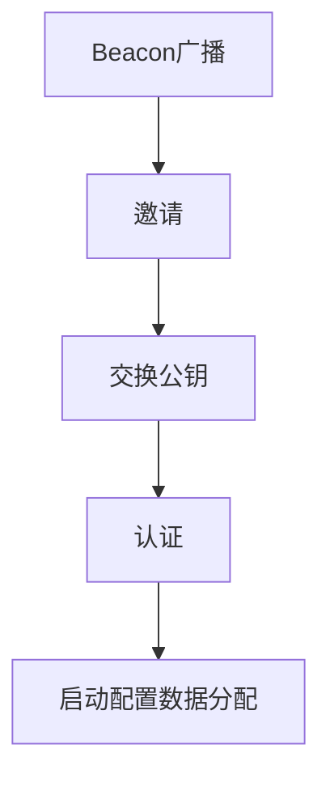

# 3.6背景知识

## 3.6.1蓝牙mesh介绍

**mesh网络的动机**

典型应用场景包括楼宇自动化和传感器网络等。

- 覆盖面积广
- 直联互通性
- 监测和控制大量设备的能力
- 优化的，低功耗的
- 有效利用无线电资源，可扩展
- 与当前市场上的智能手机、平板电脑和个人电脑产品兼容
- 符合行业标准，具有政府级安全性

通过蓝牙mesh，能够将数据中继到不在初始设备直接覆盖范围内的其他设备。mesh网络能够跨越非常大的物理区域，并包含大量设备。

**以消息为中心**

蓝牙mesh网络使用发布/订阅（publish/subscribe）消息系统。

- 设备可将消息发送至特定地址，地址的名称和含义与用户能够理解的高级概念相对应，称为发布。
- 设备经配置后，可接收由其他设备发送到特定地址的消息，称为订阅。

当设备向特定地址发布消息，订阅该地址的所有其他设备都将收到该地址的副本，并进行处理，以某种方式作出回应。

**消息和设备状态**

状态State是蓝牙mesh网络专供的一个关键概念。蓝牙mesh网络专供每台设备都具有一组独立的状态值，表示设备的某些状态。

消息、状态以及其他概念相关的设备行为都被定义在规格中，称为模型（module），由蓝牙mesh设备实施。

## 3.6.2蓝牙mesh的特性及组成

中继设备能够转发其他设备接收到的消息，在转发消息时，能够与位于初始消息发布设备无线范围以外的设备进行通信。消息可多次被中继，每一次中继为一跳，最多可支持127跳。

蓝牙mesh网络采用网络泛洪（flooding）的方式来发布和中继消息。

**网络泛洪的优势**

网络泛洪的优势在与无需特定设备专门扮演集中式路由器的角色。集中式路由器一旦发生故障，就可能会导致整个网络瘫痪，无法运行。而网络泛洪的方式，消息一般能够通过多重路径到达其目的地，从而可以构建一个可靠的网络。

**优化mesh网络**

蓝牙mesh网络采取了一系列措施，支持网络泛洪的方式，同时优化每台设备、甚至整体网络的能耗。

低功耗节点能够与一个或多个Friend节点协同工作，Friend节点不受能耗限制，可以作为低功耗节点，存储寻址到这一低功耗节点的消息，并且只有在低功耗节点需要时才传送消息。低功耗节点与Friend节点之间的关系就叫做“Friendship”。

Friend可以为低功耗节点存储消息，并在低功耗节点明确要求的情况下向其提供消息，低功耗节点可按照自身的规划进行操作，从而最优效地利用无线电。

**蓝牙mesh的代理节点**

由于BLE已经存在很多，而蓝牙mesh才推出，要想BLE能够加入蓝牙mesh网络，就需要代理节点来完成。

代理节点包含一项标准：低功耗蓝牙GATT服务，具有两个GATT特性：mesh代理数据输入和mesh代理数据输出。低功耗蓝牙设备就可使用这些特性，与mesh网络进行数据收发。

**安全性**

在低功耗蓝牙GATT的安全性配置是非强制性的。而在蓝牙mesh网络中的安全性涉及的不仅是单一设备或对等设备之间的连接安全性，还关注整个设备网络的安全性，以及网络中各组设备的安全性。

故而，在蓝牙mesh网络中，安全性是网络设计的核心，且强制使用安全性。

- 每个数据包都经过加密和认证。通过合理使用序列号能够防止中继共计，在重要流程中使用不对称技术加密技术可防止中间人（Man-in-the-middle）攻击。同时针对利用废弃设备的垃圾桶攻击提供保护，必要时刷新安全秘钥。
- 安全分级考量是蓝牙mesh网络安全性中体现的重要原则。

**协议栈**

蓝牙mesh网络引入了全新的协议栈。

- 承载层（bearer layer），定义如何使用底层低功耗堆栈传输PDU，目前有广播承载层（Advertising Bearer）和GATT承载层。
- 网络层（network layer），定义了各种消息地址类型和网络消息格式。中继和代理行为通过网络层实施。
- 底层传输层（lower transport layer），在需要之时，底层传输层能够处理PDU的分段和重组。
- 上层传输层（upper transport layer），负责对接入层进出的应用数据进行加密、解密和认证。还处理传输控制消息（transport control messages）等特殊消息，包括friendship相关的心跳和消息。
- 接入层（access layer），负责应用数据的格式、定义并控制上层传输层中执行的加密和解密过程，将数据转发到协议栈之前，验证接收到的数据是否适用于正确的网络和应用。
- 基础模型（foundation models），负责实现与mesh网络配置和管理相关的模型。
- 模型（models），模型层与模型等的实施，以及诸如行为、消息、状态等的实施有关。

## 3.6.3蓝牙mesh节点

蓝牙节点的几个特征：

- 低功耗，功率受限节点可能会利用低功耗特性来减少无线电接通时间并节省功耗，低功耗节点须与Friend节点协同工作。
- Friend特性，功率不受限节点很适合，能够存储发往低功耗节点的消息和安全更新；当低功耗节点需要时再将存储的消息传输至低功耗节点。
- 中继特性，能够接收和转发消息，实现大规模网络。
- 代理特性，实现GATT和蓝牙Mesh节点之间的mesh消息发送和接收。需要稳定的电源以及一定的计算资源。

**模型能够定义并实施节点的功能和行为，而状态能够定义元素的条件。**

**绑定状态Bound State，源自一种状态的变化导致另一状态变化的情况。**

蓝牙mesh网络可借助消息，通过客户端-服务器架构进行通信。服务器的功能是暴露元素的状态。客户端可对状态进行访问，请求、更改或使用服务器的状态。

- 服务器模型（Server Model）
  - 由至少一个或多个状态跨越一个或多个元素的状态组成。
  - 定义模型能够发送/接收的消息，并根据这些消息定义元素的行为。
- 客户端模型（Client Model），定义客户端为请求、更改或使用服务器相应状态所使用的消息
- 控制模型（Control Model）
  - 控制模型具有多种功能，可能同时包含一个或多个，客户端模型、服务器模型、控制逻辑。
  - 控制逻辑（规则和行为）用于协调与其相连模型之间的交互

模型的定义能够保证在mesh网络中对节点及其功能进行配置。

### 代理节点

代理节点是非mesh低功耗蓝牙设备成为蓝牙mesh网络成员的过程中的关键。

代理节点的根本目的是执行承载层转换，能够实现从广播承载层到GATT承载层的转换。不支持广播承载层的设备可以通过GATT连接来收发各类蓝牙Mesh消息。

**代理节点的发现**

低功耗蓝牙设备使用GAP广播来帮助其他设备发现自己。蓝牙mesh代理节点使用完全相同的技术，通过GAP可连接型广播（connectable advertising）数据包，对自身的可用性、可作为代理节点的角色、及身份进行广播。

节点标识广播的主要用途是将启动配置设备（Provisioner）快速链接到刚刚完成启动配置的节点，从而完成新节点的配置。

## 3.6.4蓝牙mesh消息

寻址、消息、发布、订阅和列表，详细介绍这些核心概念如何相互交织并构成mesh网络。

**地址**

消息用于在节点之间传输数据，地址用于定义消息源地址和目的地址。

地址包含四种类型，其中三类用于消息的传送：单播（unicast），虚拟（virtual）和群组（group）地址，第四种被称为未分配（unassigned）地址。

| 值                                              | 地址类型   |
| ----------------------------------------------- | ---------- |
| 0b0000000000000000                              | 未分配地址 |
| 0b0xxxxxxxxxxxxxxxx（不包含0b0000000000000000） | 单播地址   |
| 0b10xxxxxxxxxxxxxxx                             | 虚拟地址   |
| 0b11xxxxxxxxxxxxxxx                             | 群组地址   |

- 未分配地址，未经配置的元素或未被指定地址的元素拥有的就是未分配地址，由于没有唯一的地址，不会用于消息的传送。

- 单播地址，在启动配置期间，启动配置设备（provisioner）会在网络节点的生命周期内为节点中的每个元素分配一个单播地址。单播地址可能出现在消息的源地址字段或目的地址字段中。发送到单播地址的消息智能由一个元素进行处理。

- 虚拟地址，虚拟地址是与特定UUID标签相关联的一组元素，可能被发布或订阅。UUID标签是与多个来自一个或多个节点的元素相关联的128位值。虚拟地址b15、b14为10，13-0被设置为散列值（hash value），提供16384个散列值。散列来自于Label UUID，使用订阅元素（subscribing element）来检查完整的128位UUID，较为低效，而散列值提供了一种更为高效的方式来确定哪些消息被发送至哪些元素。

- 群组地址，群组地址是蓝牙mesh网络中的一种多播地址，通常代表一个或多个节点中的多个元素，包括两种类型：

  - 动态分配的地址（Dynamically Assigned）-> 0xC000-0xFEFF

  - 固定地址（Fixed Address），由蓝牙技术联盟分配，分为五段：

    - 保留供将来使用（RFU），0xFF00-0xFFFB
    - All-proxies（代理）， 0xFFFC，发送到启用代理功能的所有节点
    - All-friends，0xFFFD，发送到启动Friend功能的所有节点
    - All-relays，0xFFFE，发送到启动中继功能的所有节点
    - All-nodes，0xFFFF，发送到所有节点

    发送到固定节点的所有消息都有节点的主元素（Primary element）进行处理

### **消息**

蓝牙mesh网络通过消息进行通信，消息可分为控制消息和接入消息。

- 控制消息（Control Message），与蓝牙mesh网络操作有关的消息，如心跳和friend的请求消息
- 接入消息，这类消息允许客户端模型检索或设置服务器模型中的状态值，或被服务器用于报告状态值。

模型可实施并定义节点的功能。元素时节点内唯一可被寻址的实体（节点中可包含一个或多个模型），并由状态定义元素的状态变化。对于每个状态，都有一组服务器模型支持的消息。

**消息可被操作码识别**，并具有相关参数，操作码可识别消息的操作，包括：

- Generic OnOff Get，用于为通用模型识别OnOff状态Generic
- OnOff Get，不具有参数
- Generic OnOff Set，用于设置通用模型的OnOff状态，参数有：
  - OnOff，目标值
  - TID，事务标识符（Transaction Identifier），消息时新的还是转发的
  - 转换时间（Transition Time），元素从一种状态转换到另一种状态所需时长
  - 延迟（Delay），消息执行延迟

**接入消息分为经确认（acknowledge）的和未经确认的（unacknowledged）。**经确认的消息被发送到每个接收元素，并经其确认。响应通常为状态消息，未经确认的消息则不做出响应。

### 消息安全

所有蓝牙mesh网络消息的安全保障都来自网络秘钥（NetKey）和应用秘钥（AppKey）对消息的加密和验证。

网络秘钥用于网络层通信，若没有子网，mesh网络内的所有通信都使用相同的网络秘钥。

AppKey用于应用程序的数据。网络中的一些节点具有特定应用，并且根据应用的需要对一些潜在敏感数据的访问进行限制。这些节点具有特定的AppKey，并与特定应用相关联。

中继节点通常具有有效的NetKey，能够在网络内中继敏感性消息。然后这些节点却无法访问各限制区域的特定AppKey，也无法解密应用程序的数据。

### 消息交换

蓝牙mesh网络使用发布/订阅模型来进行消息传输。生成消息的节点会发布消息。需要接收消息的节点会订阅他们所需要的地址。消息可被发布至单播、群组或虚拟地址。

消息可作为对其他消息的回复而发送，也可作为非请求消息（unsolicited messages）被发送。当模型发送回复消息时，使用消息始发处的源地址作为目标地址。发送非请求消息时，模型将使用模型的发布地址作为目标地址。节点中的每个模型都有一个发布地址。

接收消息时，节点内模型（节点中可能存在多个模型）中的每个实例均可通过订阅方式从一个或多个群组或虚拟地址接收消息。

订阅消息的模型使用模型的订阅列表来定义用于接收消息的有效地址。当模型接收到消息时，模型将检查其订阅列表。当订阅列表上的地址设备为模型的元素单播地址或属于该节点的固定群组地址时，则视为一个匹配。

蓝牙mesh实体发布各种节点的状态时，无论其与发送数据的节点位置距离远近，整个蓝牙mesh网络中的系统均可订阅该数据。实现了网络一端的设备可通过低功耗无线消息与设施中的其他管理者进行对话而不受距离限制。

## 3.6.5蓝牙mesh友谊

蓝牙mesh网络中的节点是已经启动配置（Provision）并成为mesh网络中一员的设备。

### 友谊Friendship参数

低功耗节点需要找到好友节点，建立友谊关系。

- ReceiveDelay，从低功耗节点向好友节点发送请求，到其开始收听响应中间经过的时间。这让好友节点有时间做好响应的准备，并将响应发回。
- ReceiveWindow，低功耗节点用于接收响应的时间。

- PollTimeout，设定了低功耗节点发送给其好友节点的两个连续请求之间可能经过的最长时间。如果在PollTimeout计时器超时之前，好友节点都没有收到低功耗节点的请求，Friendship将被终止。

  

### 友谊的建立

1. 低功耗节点发布一个好友请求消息。该消息不会被中继，只有处于直接覆盖范围内的好友节点才能处理该消息。不具有Friend特性的节点将消息丢弃。好友请求消息包括低功耗节点的ReceiveDelay，ReceiveWindow和PollTimout参数。
2. 附近的好友节点若支持好友请求消息中特定的要求，将准备一个Friend Offer消息，并将其发送回低功耗节点。该消息包括各种参数，包括支持的ReceiveWindow大小、可用的消息队列大小、可用的订阅列表大小、以及由好友节点测量的RSSI值。
3. LPN接收到Friend Offer消息时，通过应用一种实施专用的算法来选择合适的好友节点。选择算法需要产品开发者决定。比如关注ReceiveWindow的大小，决定了功耗；RSSI值，可以确保与好友节点之间高质量的链路等等。
4. 选择好友节点之后，LPN将向好友节点发送一个Friend Poll轮询消息。
5. 收到Friend Poll消息后，好友节点会回复一个Friend Update更新消息，完成好友建立流程并提供安全参数，友谊建立。

### 友谊消息传送

友谊建立之后，好友节点将LPN的所有消息存储在“好友队列”中，即被存储的消息。

- 当好友节点收到一个寻址到该节点的LPN的消息时，好友节点会缓存此消息，将其存储在好友队列的区域中。
- LPN会周期性地启用收发器，并向好友节点发送“Friend Poll”消息，询问是否存储有任何为其缓存的消息。
- 好友节点会将一个被存储的消息发回LPN，作为“好友轮询”的响应。
- 在每次接收到来自好友节点的消息之后，LPN会将继续发送“好友轮询”消息，知道收到一条MD字段设置为0的好友更新消息为止。

### 友谊安全性

友谊采用两种特殊的安全证书：

- 主安全资料（Master Security Material），由网络秘钥派生，可被统一网络中的其他节点使用。使用主安全资料加密的消息可被同一网络中的任何节点解码。
- 好友安全资料（Friend Security Material），由网络秘钥、以及低功耗节点和好友节点生成的额外计数器号码派生而来。使用好友安全资料加密的消息智能由处理该消息的好友节点和LPN解码。

使用好友安全资料加密的相应友谊消息：

- 好友轮询，Friend Poll
- 好友更新，Friend Update
- 好友订阅列表（Friend Subscription List）添加、删除、确认好友节点发送至LPN的被存储的消息

使用主安全资料加密的相应友谊消息：

- 好友清除，Friend Clear
- 好友清除确认，Friend Clear Confirm

从LPN发送至好友节点的消息将根据应用设置，通过主安全资料或好友安全资料进行加密。

### 友谊终止

“友谊”可在某些情况下终止：

-  如果在PollTimeout超时之前，好友节点未收到“ 好友轮询”、“好友订阅列表添加”或“好友订阅列表删除”消息，则友谊终止。

- LPN可以通过将“好友清除”消息发送给好友节点，以启动友谊终止程序，“友谊”就会被好友节点终止。

## 3.6.6蓝牙mesh启动设备

要想成为蓝牙mesh网络的成员，必须经过一个称为“启动配置（Provisioning）”的安全流程，将设备添加到网络中。

安全性是蓝牙mesh网络的核心，将设备添加到蓝牙mesh网络、或移除设备的过程都将严格遵循安全性要求。

蓝牙mesh网络使用一套包含安全密钥的系统，从整体上保护网络，同时保护网络内的个个应用并将其彼此分离。拥有正确的安全密钥，设备才能成为网络成员并有权参与特定应用。网络中的所有节点都拥有网络密钥，只有设备拥有了NetKey，才能成为网络的成员。

作为mesh网络成员的设备称为节点，而不构成节点的设备就称为设备。

### 启动配置设备（Provisioner）

启动配置的流程会将普通的设备变为节点，使其正式成为蓝牙mesh网络的成员。通常需要通过一个应用程序来实现。

运行启动配置应用程序的设备称为Provisioner，在物理上必须保证其安全性。

### 启动配置协议（Provisioning Protocol）

启动配置期间，启动配置设备会采用称为“启动配置协议”的蓝牙mesh协议，与将要被启动配置的设备进行通信。启动配置设备可通过PB-ADV或PB-GATT承载层两者中的任何一个使用启动配置协议。

### 网络中添加新设备

将设备添加到网络中，最重要是为设备提供网络所有其他节点拥有的网络密钥。保证恶意设备无法窃取添加新设备时进行通信，窃取NetKey。启动配置流程分为5步：

#### 1、Beacon广播

蓝牙Mesh网络规格中介绍了新的GAP广播类型，包括《Mesh Beacon》广播类型。

设备可采用Mesh Beacon广播类型来发出广播，声明自己是未经启动配置的设备，可被启动配置。

用户需要在启动配置设备中启动“添加设备到网络”流程，以便从Beacon设备接收广播数据包。

#### 2、邀请

启动配置设备将以启动配置邀请PDU（Provisioning Invite PDU）的形式向进行启动配置设备发送邀请，此为启动配置协议的一部分。Beacon设备会在启动配置功能PDU中回应有关自身的信息。

启动配置功能PDU可提供一系列信息，如所拥有的元素数量、所支持的启动配置相关算法等。还能指示设备拥有的输入输出功能类型，将用于认证。

#### 3、交换公共密钥（Public Key）

包括启动配置设备在内的所有蓝牙mesh设备都支持FIPS P-256椭圆曲线算法，因此必须拥有公共密钥。可通过基于该算法的非对称加密来创建安全通道，完成剩余的启动配置流程。启动配置设备会与将启动配置的设备交换公共密钥。需注意，将被启动配置的设备可以通过带外方式（Out of Band），如QR码，来提供公共密钥。

#### 4、认证（Authentication）

启动配置设备基于对新设备功能的了解，向其发送消息，指示其输出单一或多位数值，对其所支持的多种用户操作作出响应。值的形式会因设备差异而有所不同。启动配置设备的用户将观察到设备（Device）输出的值，并将值输入启动配置设备的用户界面。

设备和启动配置设备交换密码散列，数据来源包括设备输出的随机值，允许完成对彼此的验证。

#### 5、启动配置数据的分配

认证成功完成后，会通过两台设备的私有密钥和交换的对等公共密钥生成会话密钥（Session Key）。随后，会话密钥可用于保护完成启动配置流程所需数据的后续分发，包括网络密钥和设备的唯一地址，及单播地址。

启动配置完成后，启动配置设备就会拥有网络的网络密钥，称为“IV Index”的蓝牙mesh安全性参数，且拥有一个由启动配置设备分配的单播地址，至此，新设备就成为网络中的一员。

### 网络中移除节点

节点包含通过启动流程提供的安全密钥，必须拥有网络密钥，才能确定它是网络的成员，并有权访问网络。当丢弃设备或将其出售时，若依然将蓝牙mesh网络的相关密钥保留，可能导致网络遭受垃圾桶攻击。

从网络中移除节点的步骤：

- 使用启动配置设备应用，将想要移除的节点添加到黑名单；
- 启动一项成为密钥刷新程序（Key Refresh Procedure）的流程。

使用启动配置设备，用户必须将想要移除的节点添加至黑名单。黑名单的目的很简单，就是当启动密钥刷新程序时，确保新的安全密钥不会被发放至黑名单中的节点。

通过密钥刷新程序，除了黑名单中的节点，网络中所有节点都会被发放新的网络密钥、应用密钥以及相关衍生数据。即整个网络和应用安全性基础的整套安全密钥都会刷新。

由于所有节点不会再同一时间收到新密钥（尤其是低功耗节点），所有会有一个称为“第二阶段”的过渡周期，此期间内新旧密钥都可使用。

第二阶段完成之后，启动配置设备会通知所有节点废除它们的旧密钥。至此，黑名单之外的每个节点都收到了新密钥。此时，从网络中移除的节点、以及包含旧网络密钥（NetKey）和旧应用密钥（AppKey）的节点将不再是网络中的成员，无法构成任何威胁。

### Provision启动配置

Provision启动配置，是向蓝牙mesh网络添加新的未经启动配置设备的过程。由启动配置设备Provisioner进行管理。

启动配置承载层（Provision Bearer）

PB-ADV，通过蓝牙广播信道进行设备启动配置的启动配置承载层。

PB-GATT，用来自代理协议的蓝牙mesh代理（proxy）PDU进行设备启动配置的启动配置承载层。

mesh网络设备默认使用的是广播承载层，负责在低功耗蓝牙广播数据包内收发蓝牙mesh的数据包。

既不支持也无法升级使用广播承载层的设备，必须使用GATT承载层。

使用GATT承载层时需要将蓝牙mesh协议数据单元（PDU）封装在代理协议（Proxy Protocol）中。

**启动配置provision**

启动配置是向蓝牙mesh网络添加新的未经启动配置设备的过程。该过程由启动配置设备（Provisioner）进行管理。启动配置设备和未经启动配置设备遵循蓝牙mesh规格中定义的固定过程。

启动配置设备向未经启动配置设备提供使其成为蓝牙mesh节点的启动配置数据（Provisioning data）。

启动配置协议栈如图，分为以下几个组件：

- 启动配置协议
- 启动配置传输
- 启动配置承载层（Provisioning Bearer），实现了启动配置PDU在启动配置设备和未经启动配置设备之间的传输。定义了两个启动配置承载层，包括B-ADV和B-GATT。
  - B-ADV，指通过蓝牙广播信道进行设备启动配置的启动配置承载层。PB-ADV承载层用于发送通用启动配置（Generic Provisioning）PDU。支持PB-ADV的设备应尽可能执行占空比接近100%的被动扫描，以避免遗漏任何发送来的通用启动配置PDU。
  - B-GATT，指使用来自代理协议的蓝牙mesh代理（Proxy）PDU来进行设备启动配置的启动承载层。代理协议能使节点通过面向连接的低功耗蓝牙（BLE）承载层来收发网络PDU，mesh信标，代理配置消息和启动配置PDU。PB-GATT在GATT操作中包含了启动配置PDU，涉及GATT启动配置服务，同时能在启动配置设备不支持PB-ADV时供其使用。

**蓝牙mesh网络安全性**

在低功耗蓝牙GATT的安全性配置是非强制性的。而在蓝牙mesh网络中的安全性涉及的不仅是单一设备或对等设备之间的连接安全性，还关注整个设备网络的安全性，以及网络中各组设备的安全性。

故而，在蓝牙mesh网络中，强制使用安全性。

| 安全策略         | 说明                                                         |
| ---------------- | ------------------------------------------------------------ |
| 加密与认证       | 所有mesh消息都经过加密和认证。                               |
| 安全分级考量     | 网络安全性、应用安全性和设备安全性彼此独立。                 |
| 区域隔离         | 蓝牙mesh网络可分为若干子网，每个子网秘钥不同，独立于其他子网，各自都是安全的。 |
| 密钥刷新         | 通过密钥刷新过程，可以在蓝牙mesh网络的整个生命周期内更改安全密钥。 |
| 消息模糊化       | 消息模糊化的作用是让外界难以跟踪网络内所有发送的消息，进而提供一种隐私保护机制，难以让外界跟踪节点的网络活动。 |
| 中继共计防护     | 蓝牙mesh安全性可保护网络免收中继攻击。                       |
| 垃圾桶攻击防护   | 节点可从网络中安全地移除，可以防止垃圾桶攻击（Trash Can Attack）。 |
| 安全设备启动配置 | 设备添加到蓝牙mesh网络以成为节点的过程是一个安全的过程。     |

## 参考

1. GAP，Generic Access Profile，通用访问配置文件，是低功耗蓝牙架构的一部分，定义了蓝牙设备如何通过广播来发送数据，通过扫描来接入数据，从而以无连接模式进行操作。
2. 广播数据类型（Advertising Data Types），指的是可被包括在广播数据包中的数据字段。
3. Generic Attribute Protocol（GATT），GATT配置文件是一个通用规范，用于在BLE链路上发送和接收被称为“属性”的数据块。目前所有的BLE应用都基于GATT。注意一个设备可以实现多个配置文件。
4. Attribute Protocol（ATT），GATT在ATT协议基础上建立，也被称为GATT/ATT。ATT对在BLE设备上运行进行了优化，使用了尽可能少的字节。每个属性通过一个唯一的统一标识符（UUID）来标识，每个String类型UUID使用128 bit标准格式。属性通过ATT被格式化为Characteristic和Service。
5. Characteristic（特征），包括一个单一变量和0-n个用来描述characteristic变量的descriptor，可以被认为是一个类型。
6. Descriptor（描述符），用来描述Characteristic变量的属性。
7. Service（服务），是Characteristic的集合，一个设备的Service可能包括了很多的特征，每个特征包含属性和值，还可以包含多个描述。
8. 相关术语：

| 简写 | 术语                      | 说明                                            |
| ---- | ------------------------- | ----------------------------------------------- |
| ATT  | Attribute Protocol        | 属性协议                                        |
| GAP  | Generic Access Profile    | 通用访问配置文件                                |
| GATT | Generic Attribute Profile | 通用属性配置文件，描述了一种使用ATT的服务框架。 |
|      | Advertising Bearer        | 广播承载层                                      |
|      | GATT Bearer               | GATT承载层                                      |
| PDU  | Protocol Data Unit        | 协议数据单元                                    |
| LPN  | Low Power Node            | 低功耗节点                                      |

## 参考链接

1. http://www.rfsister.com/article/23645342.html
2. 蓝牙mesh网络规范：https://www.bluetooth.com/specifications/mesh-specifications

